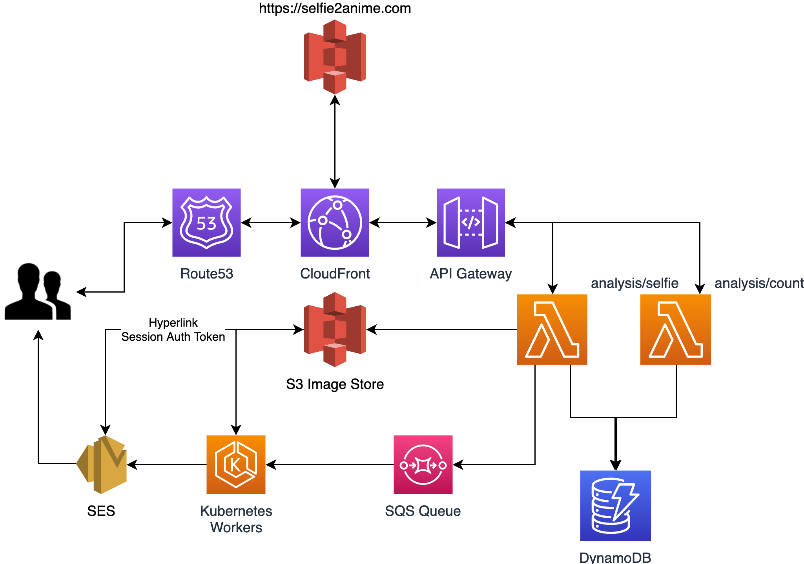

# Components

Below is a general diagram illustrating the process our workers follow to process incoming requests



## Prerequisites

Most components are built and deployed using the [Serverless](https://serverless.com/) framework.

```bash
npm install -g serverless
```

## [Image Handler](image-handler/README.md)

```bash
cd image-handler
serverless deploy
```

## [UGATIT](UGATIT/README.md)

Initialize submodule

```bash
cd ..

# Init
git submodule update --init --recursive

# Update
git submodule update --recursive --remote
```

### Build

The build process for this container is done with GCP in mind, however you can swap out for any provider.

```bash
cd UGATIT
docker build -t gcr.io/devopstar/selfie2anime-ugatit:latest .
```

#### Push GCP [Optional]

```bash
docker push gcr.io/devopstar/selfie2anime-ugatit:latest
```

#### Run Locally

```bash
docker run --name selfie2anime-runner \
    -e PYTHONUNBUFFERED=1 \
    -e QUEUE_NAME='selfie2anime' \
    -e BUCKET_NAME='selfie2anime' \
    -e SENDER_EMAIL='noreply@selfie2anime.com' \
    -e AWS_ACCESS_KEY_ID=$(aws --profile default configure get aws_access_key_id) \
    -e AWS_SECRET_ACCESS_KEY=$(aws --profile default configure get aws_secret_access_key) \
    -e AWS_DEFAULT_REGION='us-east-1' \
    gcr.io/devopstar/selfie2anime-ugatit:latest
```

#### Kubernetes Run

Make necessary changes to [UGATIT/gcp/deploy.yml](UGATIT/gcp/deploy.yml) then apply it to your Kubernetes cluster

```bash
kubectl deploy -f deploy.yml
```
